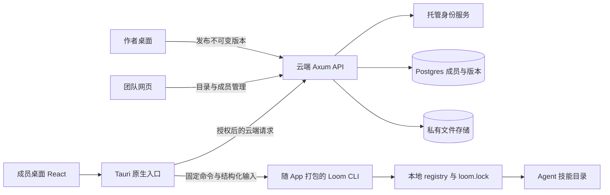

# Loom 桌面 App 与团队云端设计

日期：2026-09-08

状态：正在实施；设计目标与已验收能力分开记录，未上线。

代码基线：`f3d81f14353034921fef7c0c1b2fc72a0f4b8ae8`。

默认对象：5–25 人、已有 Skill 积累、混用不同 coding agent 的研发团队。此人群、平台优先级和商业方案均为设计假设，不代表用户已确认。

本次交付：产品范围、交互与低保真页面、技术边界、数据与接口草案、失败处理、验收和实施顺序。本文件里的新增路径、接口与字段都是拟议设计，不是现有能力声明。


## 实施记录（2026-09-08）

本次按 `threads` 使用隔离工作区实现，整合分支为 `codex/desktop-cloud`。实际实现相对原设计的明确调整：

- 首批云端使用单实例 API＋Postgres＋私有持久磁盘卷，尚未接入 Supabase Storage。API 仍负责全部下载授权，数据目录不能作为静态目录暴露。
- 首批登录使用 Supabase 邮箱 OTP；桌面凭证进入系统凭证库，网页访问令牌只在内存，刷新页面重新登录。尚未实现 PKCE 回调或网页 HttpOnly BFF 会话，不声明这些已完成。
- Supabase 必须配置可信的已验证邮箱声明；云端不信任用户可修改的 metadata。真实托管账户与邮件服务尚未做现场验收。
- JWKS 已设计并实现受限缓存刷新，签名密钥轮换不再要求手动重启。
- 小包上传采用 10 MiB 上限内的有界缓冲，解包内容保持 50 MiB/1000 文件边界；不是零缓冲流式传输。
- 桌面首次团队导入与工具激活分别呈现，云端更新复用本地引擎事务；版本是否已进入当前 Agent 会话仍单独显示。
- CI 新增云端真实 Postgres 验证和 macOS 桌面构建检查；未推送，不能把本地工作流文件当作远端 CI 已通过。

当前可运行方式与约束以 [云端说明](../../cloud/README.md)、[桌面说明](../../desktop/README.md) 为准。最终集成验收另见本次运行记录；当前记录不构成已完成三团队内测或生产发布的声明。

## 1. 产品主张与判断依据

一句话：把团队验证过的 Skill 分享给同事，在各自的 AI 工具中安装、使用和更新。

核心故事：Alice 用一个代码审查 Skill 改善了团队工作。她从本机发布它，Bob 接受邀请后看到用途与使用示例，将它安装到自己的项目，在 Codex 中完成一次审查。Alice 发布修订后，Bob 能看到变更并更新；如果本地改过，Loom 会指出差异并保留现场。

用户购买的价值是减少重复配置、寻找文件和处理版本差异的时间。桌面入口降低本机操作门槛；团队共享让个人积累可以复用。网页热度低是否由形态造成仍未验证，不能把换壳视为增长证据。

竞品基线：SkillReg 已公开描述团队私有 Registry、跨 Agent 安装、后台更新、本地修改保护和桌面/CLI 共享状态。因此“有 App”“能同步”“有版本”属于竞争基线。值得验证的体验优势是：分享现有 Skill 足够轻、同事看得懂用途、安装后知道如何使用、失败时能自行解决。[SkillReg 桌面文档](https://skillreg.dev/docs/desktop-app)、[安装文档](https://skillreg.dev/docs/installing)。未登录实测，不宣称竞品缺少这些体验。

## 2. 第一版范围

### 必须完成

| 能力 | 第一版行为 |
| --- | --- |
| 桌面使用 | 下载、安装、打开；浏览和管理本地 Skill 无需云端登录 |
| 团队 | 创建一个团队、接受邀请、查看成员、移除成员 |
| 分享 | 选择现有 Skill 目录，检查文件清单，填写用途与示例，发布版本 |
| 发现 | 搜索团队 Skill 名称和描述，浏览详情与历史版本 |
| 安装 | 选择已有 Agent 与项目，先预览再安装；明确显示本地结果 |
| 更新 | 检查团队推荐版本，展示变更，由用户点击更新 |
| 恢复 | 从安装位置发起恢复历史版本，预览全部关联目标后执行，并固定该版本 |
| 冲突 | 显示本地修改、同名占用、权限不足；不覆盖无关文件 |
| 云端管理 | 网页完成邀请、团队浏览、版本查看与成员管理 |

### 第一版不做

公开市场、收费交易、在线多人编辑、云端运行 Agent、自动生成 Skill、统一模型账户、远程控制成员电脑、后台常驻守护进程、自动推送安装、部门层级与自定义角色、自动审批流、移动 App、全员调用分析。

自动更新、技能包、企业审批和使用统计只有在试用中出现明确需求时再排期。已有 CLI 的高级功能继续由原有入口提供，不要求全部搬进新 App 导航。

### 平台与语言

建议先验收 macOS Apple Silicon，第二批覆盖 Windows x64；Intel Mac/Linux 随实际试用者需求排期。首批正式支持的 Agent 为 Claude Code、Codex、Cursor，每个都必须经过真实安装和可见性测试。未经测试的组合标明未验证，不用“支持所有 Agent”宣传。

界面先提供中文；正式面向海外招募前补齐英文。发布包内含 Loom 引擎，用户不需要先安装 Rust 或 Bun。现有引擎依赖 Git，首启必须检测；缺失时提供明确安装指引，不能宣称完全零依赖。

## 3. 用户、权限与内容归属

第一版团队只有两种成员角色。团队创建者为唯一 owner；owner 不能直接退出或被移除，必须先把所有权转交给一名现有成员，转交和原 owner 降级在一个事务中完成。

| 操作 | Owner | Member |
| --- | --- | --- |
| 查看、下载团队内全部 Skill | 可以 | 可以 |
| 创建 Skill 并发布首版 | 可以 | 可以 |
| 发布后续版本、修改介绍、归档 | 任意团队 Skill | 自己维护的 Skill |
| 调整推荐版本 | 任意团队 Skill | 自己维护的 Skill |
| 转交 Skill 维护人 | 可以 | 不可以 |
| 邀请、移除成员、转交团队 | 可以 | 不可以 |

Skill 归团队所有，`maintainer_id` 指定负责人；版本记录真实发布者。成员退出后历史署名保留，其 Skill 由 owner 接管。第一版允许成员直接发布，明确不宣传已审核或双人审批。

“发布成功”只说明文件与权限检查通过，不表示 Skill 经过安全认证，也不自动授予本地 `team-approved` 信任。Loom 现有本地风险和组织策略仍可阻止安装或要求用户完成现有审核操作。

默认所有团队内容私有，没有公开分享链接。邀请绑定邮箱，owner 复制一次性链接自行发送；接受者必须登录并拥有匹配的已验证邮箱。链接七天过期、只能成功使用一次、owner 可撤销；账户不匹配时解释原因，不自动换团队或邀请他人。

## 4. 用户流程

### 4.1 首次启动

1. 展示“管理本机技能”和“加入团队”两个入口。邀请入口携带团队信息，登录后回到邀请页面。
2. 检查 Git 和已有 Agent 安装情况，只读取已知技能目录。项目目录由用户选择，不递归扫描整块磁盘。
3. 展示发现的 Skill，标明“尚未由 Loom 管理”。用户未选择导入前保持只读。
4. 登录时用系统浏览器。取消登录不影响本地浏览；云端不可达显示具体失败和重试入口。
5. 加入团队后进入团队技能；团队为空则显示“分享第一个 Skill”，附用途与示例的填写指导。

已有 `~/.loom-registry` 时读取现有状态。状态损坏、版本不兼容或根目录错误必须停止写入并给出诊断，不能创建新目录掩盖错误。首次无 registry 时使用现有初始化语义，禁止把源码 checkout 当 registry。

### 4.2 作者分享

1. 在“本机技能”选择一项，点击“分享到团队”；也可选择一个完整 Skill 文件夹。
2. 显示将上传的文件树、大小、用途、作者署名和目标团队。Skill 包包括脚本与参考资料，不仅是 `SKILL.md`。
3. 必填：名称、简短用途、至少一个可复制的使用示例。首版默认建议 `0.1.0`，用户可调整。
4. 在明确的发布动作中检查包边界与已有风险扫描结果；有凭证疑点时定位文件，不把敏感原文打印到日志。
5. 点击发布后显示“准备文件 → 上传 → 确认版本”；只有服务端版本提交成功才显示成功。
6. 成功页提供“查看团队中的 Skill”和“复制团队内链接”。不自动发送消息给同事。

本地修改不会自动上传。云端发布也不会自动切换作者已有安装位置的版本，两项动作分别给出结果。

### 4.3 同事安装与第一次使用

1. 详情首屏先展示用途和示例，再展示文件与版本。主按钮为“安装到我的工具”。
2. 默认选一个已检测到的 Agent；首次默认项目范围，用户主动选择项目目录。全局范围用“所有项目可用”解释影响。
3. 安装预览显示目标工具、目录、版本和将写入的文件数量。没有 Agent 时给安装指引，不悄悄创建目录并声称支持。
4. 解析固定的云端版本，下载到临时区域，校验后进入现有 Loom 安装、来源记录和激活流程。
5. 成功后显示实际安装结果、依赖检查、可见性与新会话提示；提供“复制使用示例”。依赖缺失时标明具体工具或变量名并链接作者准备说明，不收集或上传变量值，不自动安装依赖。第一版不代替用户执行 Skill。
6. 可选按钮“我已成功使用”，只计为用户自报，不作为自动验证的执行证据。

一个 Skill 安装到多个 Agent 时逐目标展示结果。部分成功显示“2 个成功，1 个失败”，可重试失败目标；不承诺跨不同工具目录的全局事务。

### 4.4 发布新版与更新

作者从本地修改发布一个新版本，填写变更说明。上传时带原推荐版本，避免两人同时发布悄悄改变推荐结果。新版本提交时若推荐版本已变化，返回冲突并展示最新状态，作者重新确认后再发布。

成员打开 App、回到前台或手动点击时检查更新。App 打开期间可以每 15 分钟带随机抖动检查一次目录；关闭后不继续同步。失败显示“检查失败，上次成功时间…”，不显示“已是最新”。

更新前显示版本差异、依赖变化、脚本变化、目标位置。用户确认后重新读取本地状态；如果预览后发生修改或策略变化，使原计划失效，停止并要求重新预览。

### 4.5 本地修改、恢复与离队

| 情况 | 明确行为 |
| --- | --- |
| 修改了受管 Skill | 标记“本地有修改”，暂停更新；可查看差异、保留现状、将当前内容另存到用户选定目录后重新计划更新 |
| 同名 Skill 来自别的来源 | 阻止覆盖，展示两个来源；用户可选择另一个项目，或显式重命名本地内容后重新安装 |
| 恢复旧版 | 从该安装位置选择历史版本，列出同一 registry 内关联目标后恢复；设为固定版本，避免下次检查误作必须升级 |
| 解除固定 | 用户显式选择跟随推荐版本；仍需手动确认更新 |
| Skill 归档 | 从默认目录隐藏，停止新增安装；成员仍可查看历史、恢复已有安装；可由维护人取消归档 |
| 成员被移除 | 后续云端读写拒绝，App 下次在线检查清理该团队的目录与待下载缓存；不远程删除已安装文件 |
| 退出账户 | 删除本地会话凭证与私有目录缓存；已安装文件保持原样，并提示它们仍在本机 |

已下载文件无法被云端可靠收回，第一版不提供远程撤销承诺。离队后离线文件仍可能被 Agent 使用；后续下载和云端历史访问立即受成员权限约束。

## 5. 信息架构与界面草图

桌面主导航：团队技能、本机技能、更新；底部为团队设置、账户。顶部显示当前团队，允许切换已加入的团队；不提供批量跨团队操作。诊断和引擎细节放在具体问题的展开区域。

```text
┌ Loom ──────────────── Acme 团队 ▾ ──────────────────────────┐
│ 团队技能       │ 搜索团队技能…                  分享 Skill │
│ 本机技能       │                                            │
│ 更新       2   │ 代码审查                  Alice · v1.2.0   │
│                │ 按团队约定检查 PR，重点检查数据与异常路径。 │
│                │ [查看详情]                       [安装]   │
│                │                                            │
│                │ 接口文档                  Chen · v0.3.0    │
│                │ 根据代码生成团队使用的接口文档。           │
│ 团队设置       │ [查看详情]                    已安装 v0.3.0│
│ 账户           │                                            │
└─────────────────────────────────────────────────────────────┘
```

```text
代码审查                                   [安装到我的工具]
由 Alice 维护 · 推荐版本 v1.2.0 · 最近发布 9 月 8 日

用途
在提交 PR 前检查团队关心的数据一致性和异常处理。

试着这样使用                                      [复制]
“使用代码审查 Skill，检查我当前分支的修改。”

需要准备：Git；可选 GitHub CLI（仅在线读取 PR 时）
适用工具：声明支持 Codex、Claude Code（本机结果另行检查）

[介绍] [文件 6] [版本历史]
当前安装：Codex / backend 项目 / v1.1.0  [查看更新]
```

示例内容为虚构演示，不代表已有用户或实测支持声明。

设计原则：一屏一个主要动作；用途与示例优先于技术状态。列表默认按最近更新排序，用文本标签区分本地修改、待更新、固定版本与检查失败，不只靠颜色。技能详情中的 Markdown 禁用原始 HTML，外链在系统浏览器打开。

视觉建议：浅灰背景、白色内容区、单一蓝色主操作；14–16px 正文、明显焦点轮廓。桌面最小设计宽度 960px，浏览器端小屏导航折叠。支持键盘搜索、Tab 导航、Esc 关闭弹窗；长路径换行或可复制，关键错误不能只放短暂 toast。

所有页面都设计加载、空数据、无权限、请求失败和离线状态。离线目录标明缓存时间；失败不得用空列表代替。

网页复用团队目录、详情和团队设置。网页上的安装动作给出“在 Loom 中打开”；未安装 App 时提供下载入口。链接只带不敏感的团队/Skill 身份，登录后重新授权，不携带令牌，不自动执行安装。

## 6. 状态与成功口径

复用当前引擎已有状态，不新建一套枚举去压平不同事实。以下中文是显示文案，不是新增的全局错误码或状态机。

| 事实 | 证据 | 可以显示 | 不能推断 |
| --- | --- | --- | --- |
| 云端版本已发布 | 数据库版本事务提交 | 已发布 v1.2.0 | 全员已更新 |
| 本地安装完成 | 引擎写入、来源与安装结果 | 已安装 | Agent 已加载 |
| 依赖就绪 | 引擎支持的依赖探测 | 依赖检查通过 | Skill 一定执行成功 |
| Agent 可发现 | adapter/visibility 结果 | 可发现、需新会话、未知 | 正在运行的会话已经刷新 |
| 用户实际使用 | 用户主动确认 | 用户确认使用成功 | 可验证的自动执行次数 |

联网检查只描述团队目录与推荐版本，不复用现有 Git `registry_transport` 作为云端状态。传输、文件分发、Agent 可见性保持不同证据来源。

## 7. 现有代码与复用边界

下列代码已在本次读取；未运行功能测试，不以存在文件宣称运行验收通过。

| 现有位置 | 已确认用途 | 本设计如何处理 |
| --- | --- | --- |
| `Cargo.toml`、`src/lib.rs` | Rust CLI；已有库入口，但核心模块多数私有；已有 Axum | 不先大规模抽取公共 SDK；桌面内置版本绑定的 CLI |
| `panel/package.json` | React、Vite、Bun 前端 | 沿用工具链，复用基础样式、详情和差异展示 |
| `src/panel/handlers/mutations.rs` | 本地 Panel 写操作复用命令和核心服务 | 保持单一写入语义；新桌面不要直接写 registry JSON |
| `src/commands/provider_cmds/model.rs` | Provider 当前主要为 GitHub/Local | 新增云端来源接入是实际新工作，不能只换一个 URL |
| `src/commands/provider_cmds/install.rs` | 来源、lock、trust、审计和安装写入 | 云端包经过同一路径；临时解包路径不能冒充真实来源 |
| `src/commands/projection_executor/convergence.rs` | 分发与收敛操作 | 复用本地计划、执行和恢复机制 |
| `src/commands/skill_deps.rs`、`src/commands/codex_visibility.rs` | 依赖与可见性检查 | 复用结果与不确定性，不在 React 重做判断 |
| `src/commands/org_policy/mod.rs` | 角色、组织策略、审批命令已经存在 | 本地检查保留；不能承担云端身份认证 |
| `src/commands/skillset_cmds.rs` | 已有技能组合命令 | 本期不新增团队技能包产品功能 |

既有规格 `[GH381](../../specs/GH381/product.md)` 的状态标签仍为 Blocked，但代码已有组织治理命令；本文以读取的代码为准，不据标签认定未实现。既有 `[Provider 边界](../SKILL_PROVIDER_BOUNDARY.md)` 已允许未来企业 registry 供给内容；本设计延续其“云端提供来源、本地引擎决定如何写”的职责。

## 8. 技术方案

选择一个小型单体云端服务，桌面继续使用本地引擎。第一版不需要微服务、消息总线、向量数据库或 CRDT。



### 8.1 桌面

建议使用 Tauri 2，内置与 App 同一发布版本的 Loom CLI sidecar，按需启动固定操作。Tauri 官方支持打包外部二进制，适合避免用户额外安装引擎。[官方文档](https://v2.tauri.app/develop/sidecar/)

React 调用具名的原生动作，如安装预览、应用已预览计划、读取本机状态。原生层组装参数数组，不提供任意 shell 或任意 CLI 字符串执行入口；不从 PATH 选取未知版本 `loom`。stdout 解析既有 JSON envelope，stderr 用于脱敏诊断。写操作使用现有 workspace lock；超时或 App 退出后根据操作记录确认状态，不把“进程未响应”直接当作“没有写入”。

保持现有 Panel 浏览器入口。桌面与网页只复用实际共用的 React 组件、视图与云端请求模块；现有 Panel 的全部 HTTP 路由不需要做成通用跨端框架。桌面本地请求通过原生桥，网页不会获得本地写入能力。

Git 依赖为首批工程验证项：先检测用户系统 Git，缺失明确阻止写入并引导安装。是否随 App 分发 Git，只有在新用户测试证明安装门槛过高时再决定。

### 8.2 云端

建议 Rust/Axum 单体 API，Postgres 保存团队和版本元数据，私有对象存储保存包；托管身份与存储优先评估 Supabase Auth/Postgres/Storage，以减少自建账户系统。这里是技术选型建议，未创建项目、购买套餐或确认地区。

业务 API 是团队授权的唯一应用边界：先验证身份令牌，再从数据库检查当前成员与操作权限；SQL 使用绑定参数，所有团队资源查询都带团队约束。数据库关系约束防止跨团队引用。浏览器与 App 不直接访问业务表；关闭这些表对 Supabase Data API 的暴露/访问授权，不把服务端凭证发给客户端。私有桶默认拒绝客户端直读，下载经过 API 当前授权。

第一版小文件上传和下载通过 API 流式转发，不发长期公开 URL。这样移除成员能阻断新请求；已经开始的下载和已经交付的字节无法收回。存储读取失败明确返回错误。[Supabase 私有桶说明](https://supabase.com/docs/guides/storage/buckets/fundamentals)

### 8.3 登录与设备凭证

采用托管身份服务的浏览器授权码＋PKCE。优先邮箱验证码登录，避免把 GitHub 仓库权限变成使用前提。浏览器完成登录后回到 App 注册的回调；原生端校验本次登录的 state、PKCE 与回调目标，回调只带短时授权码。精确流程必须先通过桌面认证验证切片，不凭文档假定所有系统组合可用。[PKCE 文档](https://supabase.com/docs/guides/auth/sessions/pkce-flow)

桌面刷新凭证只放系统凭证库，访问令牌在原生层内存使用；不写到 Git、前端 localStorage、命令行参数或日志。原生层向本次云端 provider 操作通过受限 stdin/进程通信传递短期凭证，完成即释放。网页凭证采用短期内存会话及安全 HttpOnly 会话 cookie，写请求校验来源/CSRF；具体会话集成遵循所选身份服务。

每次团队资源请求重新检查成员资格，不能只依赖 JWT 中过时的角色。身份系统的用户 id 是云端主体；Git author、邮箱字符串或本地 `roles.json` 都不能自行证明云端权限。

### 8.4 本地与云端状态归属

| 数据 | 权威位置 |
| --- | --- |
| 成员、维护人、团队推荐版本 | 云端数据库 |
| 某个版本的实际文件包 | 云端不可变对象＋校验值 |
| 本机安装、来源、锁定版本、分发与本地改动 | 当前 Loom registry 和 lock 模型 |
| 本机凭证 | 系统凭证库 |
| 团队目录缓存 | App 缓存，带账号和团队身份；可删除，不能作为授权依据 |

不把本地 `state/`、Git 历史、机器路径、roles 文件整体上传到云端。云端成员角色与本地写入策略各管自己的资源，不互相同步或覆盖。

同一个 registry 里同源同名 Skill 的多处分发必须遵循现有引擎版本关系。第一版不新增“同一 registry 的同一 Skill 同时多个版本”的模型；不同项目必须分别管理 registry 才能独立固定版本。UI 若此次更新会影响多个现有 binding，要完整列出影响范围，不显示为单目录更新。

## 9. 包、来源与更新一致性

### 9.1 包契约

包根目录包含 `SKILL.md`，允许相对路径下的 scripts、references 和 assets。发布前展示文件清单；拒绝 `.git`、`.env` 等私密文件、绝对路径、越界路径、软硬链接和特殊设备文件。第一版拒绝链接并解释如何整理为普通文件，不跟随链接读出边界外内容。大小初值：压缩包 10 MiB、解包内容 50 MiB、最多 1,000 个文件；这些是服务资源边界，依据试用包大小再调整。

客户端预览用于告知用户；服务端在不可信上传边界校验包结构、资源限制和声明摘要，不执行包里的任何脚本。接收与本地解包复用各自边界内的一次校验流程，避免重复的规则引擎。额外安全扫描结果标注检查范围，不宣称所有凭证或风险都能被识别。

每版分配稳定 version id、语义版本标签和包 SHA-256。对象使用服务端产生的不可变 key。版本文件不可覆盖；同版本同摘要重试返回既有结果，不同摘要冲突。Skill 的展示介绍可改，版本内文件、版本说明和发布者不可原地修改。

### 9.2 发布提交

API 接收元数据和包 → 流式暂存并校验 → 将对象写入唯一 key → 开启数据库事务，锁定 Skill 并重新验证成员/维护权限与原推荐版本 → 插入版本、更新推荐指针、记录发布事件 → 提交 → 返回版本。

对象失败时不插入可见版本；数据库失败时对象不能被列出或下载。定时清理超过 24 小时且无版本引用的暂存/孤立对象，执行前再次查引用。版本与推荐指针只在同一数据库事务内更新。

幂等键以 actor＋team＋operation 为范围，保存请求摘要及结果 24 小时；同键不同内容返回冲突。最终以唯一版本约束兜住超出窗口的重试。客户端超时后先查询版本，再决定重试，不重复生成新版本。

### 9.3 安装提交

解析推荐版本时固定 version id，不在下载过程中重新跟随 latest。引擎 provider 接收云端团队、Skill id、version id、摘要与来源定位信息；验证下载后进入现有 install/provenance/plan/apply 路径。不得先作为临时 local source 安装、再在 UI 私有记录里补一个云端来源。

本地来源身份包含服务实例＋team id＋skill id；同名跨团队视为不同来源并阻止覆盖。`requested_ref` 与实际固定版本分别记录，不虚构 Git commit。包摘要与现有 source tree hash 按不同算法与用途分别标识。

更新时读取当前 source、target、策略与版本，生成计划，再使用引擎既有锁与恢复记录应用。第一次 provider install 当前会拒绝已存在的目标，因此“更新已有云端来源”必须明确扩展引擎事务，不能在桌面层先卸载再安装。来源与本地变更不匹配时停止。

单目标写入成功但可见性未知时显示该真实结果。需要用户重启 Agent 时给操作提示，不能靠再次复制文件假装修复。安装与更新过程中不主动运行 Skill 脚本。

## 10. 云端数据模型草案

仅列实现当前流程必要的数据。类型和命名在实际迁移时定稿，不额外引入通用资源层。

| 表 | 核心字段与约束 |
| --- | --- |
| teams | id、name、owner_user_id、created_at；owner 必须为本团队有效成员 |
| memberships | team_id、user_id、joined_at；联合主键；owner 由 teams 判断，避免重复角色字段 |
| invitations | id、team_id、email、token_hash、expires_at、accepted_at、revoked_at、created_by；接受过程锁定记录并创建 membership |
| skills | id、team_id、slug、title、description、example、maintainer_id、archived_at、recommended_version_id、updated_at；team＋slug 唯一 |
| skill_versions | id、team_id、skill_id、version、artifact_key、sha256、size_bytes、file_manifest、release_notes、published_by、created_at；skill＋version 唯一；manifest 为服务端校验时生成的路径、类型和大小清单 |
| team_events | id、team_id、actor_id、action、subject_id、created_at、最小附加信息；与业务变更同事务，不能写包正文与秘密 |
| idempotency_requests | actor_id、team_id、operation、key、request_digest、result、expires_at；请求范围内唯一 |

身份用户资料由托管 Auth 维护，不复制密码或另建账户身份系统。跨表外键约束 team 与 skill/version 的一致性；推荐版本必须属于同一个 Skill。成员删除前处理维护权和 owner 约束。UUID 的不可猜测性不能代替授权。

按 team＋updated_at/id 查询目录；按 skill＋created_at/id 查询历史；搜索先用 Postgres 文本匹配，目录小规模无需搜索服务。目录缓存 ETag 只用于省流量，请求仍先检查成员资格。

## 11. API 草案

云端使用独立 origin 下的 `/v1`；本地 Panel 保持既有 `/api/v1`。两种服务不得混用 base URL、凭证或授权逻辑。真实域名、端口和密钥由部署配置提供，文档不指定生产值。

| 接口 | 目的与写入条件 |
| --- | --- |
| GET /v1/me/teams | 当前用户团队列表 |
| POST /v1/teams | 创建团队并原子创建 owner membership；要求幂等键 |
| GET /v1/teams/{team}/members | 当前团队成员 |
| POST /v1/teams/{team}/invitations | owner 创建邮箱绑定邀请；返回一次性链接 |
| DELETE /v1/teams/{team}/invitations/{id} | owner 撤销未使用邀请 |
| POST /v1/invitations/accept | 登录后提交邀请 token；匹配已验证邮箱，原子消费 |
| DELETE /v1/teams/{team}/members/{user} | owner 移除他人，或成员退出；owner 不能直接退出 |
| POST /v1/teams/{team}/transfer-owner | owner 转交现有成员，锁团队行处理并发 |
| GET /v1/teams/{team}/skills?q=&cursor=&limit= | 目录与名称/描述搜索；默认排除归档 |
| GET /v1/teams/{team}/skills/{skill} | 简介、示例、推荐版及当前维护人 |
| POST /v1/teams/{team}/skills | 元数据＋首版包，一次发布；失败不留下空 Skill |
| PATCH /v1/teams/{team}/skills/{skill} | 维护人改介绍/归档，owner 可转交维护人；If-Match 防止覆盖并发编辑 |
| GET /v1/teams/{team}/skills/{skill}/versions | 版本列表，带 cursor |
| GET /v1/teams/{team}/skills/{skill}/versions/{version}/files | 已授权版本的文件清单；只返回包内相对路径 |
| GET /v1/teams/{team}/skills/{skill}/versions/{version}/file?path= | 从已验证包读取清单内的文件；UTF-8 文本最多预览 256 KiB，二进制仅显示元数据，不执行或渲染 HTML |
| POST /v1/teams/{team}/skills/{skill}/versions | 元数据＋包＋expected_recommended_version_id；发布事务 |
| PUT /v1/teams/{team}/skills/{skill}/recommendation | 指向已有版本，带 expected_version_id；只改云端推荐，不改成员文件 |
| GET /v1/teams/{team}/skills/{skill}/versions/{version}/artifact | 当前成员授权后下载，校验版本属于该 Skill |

新增云端返回 `{data, request_id}`，失败返回 `{error: {message}, request_id}`，以 HTTP 状态表达请求类别。使用 401、403/404、409、413、429、5xx 的通常语义；跨团队资源不泄露是否存在。首版不建立新全局闭集错误码体系。本地 CLI envelope 与错误码保持原样供桌面展示。

分页默认 50、最多 100，稳定 cursor 以排序键和 id 组成，游标无效明确报错。写接口的版本创建请求支持幂等；PATCH 和推荐指针使用条件更新。目录和包都返回大小与摘要信息；token、包正文、真实本机路径不得进入访问日志。

## 12. 隐私、可靠性与运维

云端只收用户主动发布的 Skill 包、必要账户与团队信息；不默认上传本机 Skill 全量、项目源码、聊天记录、环境变量或安装清单。第一版团队页不显示“全员已同步”，因为没有收集设备回执。

这是会交付可执行脚本的产品，真实边界必须验收：跨团队访问、归档规则、解包越界、包大小、被篡改摘要、会话泄露、Markdown 注入。将发布内容渲染为不具备本机命令权限的文本，安装动作只能来自受信界面与原生具名入口。认证、秘密和进程调用实现按本仓库全局约定做人工审查。

最小部署为一个 API 服务＋托管 Postgres/Auth/私有存储；静态网页与 API 可同源。开发、测试、生产用不同项目和凭证。API 请求日志只保留 request id、操作、状态与耗时。发布、邀请、权限变更写必要审计事件，不建立员工行为监控。

数据库和包必须一起纳入恢复方案：每日数据库备份，私有对象按不可变版本保存并备份；测试环境做一次从备份恢复目录并下载正确摘要的演练。内测恢复目标暂定 RPO 24 小时、RTO 1 个工作日，需演练证明后再对用户承诺。云端不可用时已安装 Skill 继续由本机 Agent 读取，新发布/下载明确失败。

App 与内置引擎作为同一个发布包签名和更新。正式分发前完成 macOS 签名/公证及 Windows 签名准备；App 更新使用签名产物验证，更新中断保持旧 App 可启动。[Tauri 更新文档](https://v2.tauri.app/plugin/updater/)

第一版用归档替代用户自助永久删除。正式对外服务前定义团队注销、包及备份清除周期、账户删除流程与地域，支持人员按可核验流程处理；未完成前只做受邀内测，不把文件永久删除能力写进产品承诺。这里未开展法务合规审查。

## 13. 商业与效果验证

内测免费，只提供一个团队体验，不先接支付系统。收费假设是按团队收取基础订阅，避免邀请同事立即增费；具体金额需通过真实团队续用与付费访谈确定。

SkillReg 当前公开 Team 为 29 美元/组织/月、25 名成员及 100 个 Skill，可作为访谈参照，但不能证明市场愿意付费，也不是 Loom 的确定价格。[价格来源](https://skillreg.dev/)

首批找 3 个团队，每队 3–5 名实际参与者。每队用真实 Skill 完成一个发布和一次更新。以下数字为预先设定的决策门槛，不是行业数据：

| 指标 | 试验口径 | 进入下一阶段的信号 |
| --- | --- | --- |
| 第二人激活 | 非作者接受邀请、安装并自报成功使用 | 至少 2/3 团队各有 2 名非作者完成 |
| 首次使用耗时 | 接受邀请至完成示例；安装 Agent 等前置时间单列 | 大多数参与者在 10 分钟内完成，记录真实卡点 |
| 更新成功 | 非作者在保留本地修改规则下更新或明确固定旧版 | 至少 2 个团队完整完成一轮 |
| 两周复用 | 第 2 周非作者再次使用、安装或更新 | 至少 2 个团队主动回来，无需逐人提醒 |
| 付费意愿 | 团队负责人针对实际体验讨论购买 | 能描述明确预算与替代方案；口头兴趣不计收入 |

优先通过受邀测试记录和访谈采集。可选产品遥测须明确同意，事件仅包括发布、安装结果、复制示例与用户确认；用户确认和真实 Agent 调用始终分开。第一版不新增通用埋点平台或扫描聊天来推断效果。

## 14. 分期实施与验收

按依赖串行推进，每期交付可演示结果。以下是后续实现范围，不表示本次已授权自动进入开发或上线。

| 阶段 | 工作 | 退出条件 |
| --- | --- | --- |
| A：工程验证 | Tauri 内置引擎、Git 检测、登录回调、读取现有 registry；用测试账户和临时项目 | 干净机器能启动并读取；无需开发工具；身份回调、取消登录、错误路径可解释 |
| B：两人闭环 | 团队/邀请/首版发布/目录/下载、云端 provider 与本地来源记录 | 两个账户、两台机器、不同 Agent 完成发布与首次安装；跨团队访问失败 |
| C：版本闭环 | 后续发布、条件更新、差异、本地冲突、恢复旧版、离队 | 一轮真实更新与恢复；失败和崩溃不丢失用户文件、不虚报成功 |
| D：受邀内测 | 签名包、备份恢复、三团队试用、修复首用问题 | 第 13 节指标有记录；决定继续、缩小人群或调整需求 |

不按固定周数承诺工期；A 完成后根据 Git 依赖、认证集成和现有事务复用结果估算 B/C。若 A 出现必须大改引擎公共接口的方案，先比较 sidecar 最小方案，再决定是否值得重构。

### 需要触达的模块

拟新增 `desktop/` 放 Tauri 壳与打包配置，`cloud/` 放 Axum 服务与必要数据库迁移；前端沿用 `panel/` 工具链和真正共享组件。扩展现有 provider、来源、更新事务与 CLI 最小命令面；新增云端命令具体命名在实现 B 时对照现有契约定稿，不在桌面伪造已存在的命令。

既有 `src/panel/` 继续承担本地 Panel。已有组织策略不能因云端接入被清空或绕过。不迁移历史 registry、不同步本地 Git roles 到云端、不修改用户未选择的目录。

### 验收场景

| 场景 | 必须观察到的结果 |
| --- | --- |
| 已有 registry 和个人 Skill | 可只读查看；未授权导入的内容不变 |
| Git 缺失、Agent 缺失 | 明确阻止相关操作并给指引，不显示安装成功 |
| 邀请重用、过期、邮箱不符 | 明确拒绝；不增加成员 |
| 团队 A 访问 B 的详情、版本或包 | 全部拒绝，不泄露内容 |
| 成员被移除但 JWT 尚有效 | 下一次目录/发布/下载请求被拒绝 |
| 上传断网或响应丢失 | 可查询或幂等重试；无重复版本和半成品 |
| 两人同时发版或改推荐版 | 条件更新产生明确冲突，不悄悄覆盖 |
| 包越界、链接、解压炸弹、摘要不符 | 拒绝；registry 和目标文件不变 |
| 跨团队同名 Skill | 展示来源冲突，不自动替换 |
| 本地有修改或预览后新修改 | 原计划停止，原文件保留 |
| 多目标部分失败 | 按目标显示结果，只重试失败目标 |
| 更新中断/进程崩溃 | 读取既有恢复记录，证明原版或新版状态，不盲目重做 |
| 恢复旧版 | 实际摘要与选择一致；固定状态清楚 |
| Agent 需要新会话 | 显示提示；文件安装成功不冒充会话加载成功 |
| 云端不可达 | 已安装文件继续可用；更新结果为未知/失败 |
| 签名更新被篡改 | App 拒绝更新，旧版仍可启动 |
| 备份恢复 | 目录、版本、成员与包引用一致，文件摘要可验证 |

实施时沿用现有检查入口：`make panel-typecheck`、`make panel-test`、`make panel-build`；Rust 按变更运行 `tests/provider_cli.rs`、`tests/skill_provenance.rs`、`tests/org_policy.rs`、`tests/agent_plan_apply.rs`、`tests/codex_visibility.rs` 等对应测试。云端增加真实租户隔离与并发事务测试，桌面增加安装中断与真实 Agent 验收；广泛检查留给既有 CI。本文档交付只检查内容、相对链接和改动范围，不声称实现测试通过。

## 15. 评审决策

本设计建议采用：研发小团队先行、桌面负责本地操作、云端负责团队文件与成员、内置 CLI、第一版手动更新、两种成员角色、无云端执行、无设备监控。

需要产品负责人在实施前决定的商业问题：第一批用户是否确为研发团队，macOS/Windows 谁先，首发地区和数据区域。域名、托管账户、签名证书及预算属于上线前的具体资源事项，不阻止当前设计与本地验证。

工程验证必须解决的事项：系统 Git 在干净机器上的安装门槛；PKCE 回调与凭证库实测；云端来源更新如何接入现有本地恢复事务；当前 registry 的多目标版本关系与页面呈现。验证结果只修改本文件相应章节，不增加并行的另一份产品规格。
